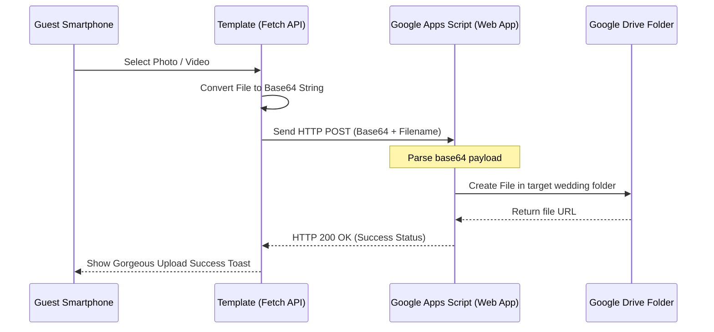

# 🧩 Dynamic Component Blueprints

To ensure that the wedding invitation templates are highly performant, accessible, and fully dynamic, follow these implementation specifications for the core interactive components.

---

## ⏳ 1. The Premium Loading Screen (`components/Loader.tsx`)

The loading screen acts as a transition barrier, allowing assets (such as the heavy background MP4 video and high-resolution images) to cache in the background before revealing the elegant invite.

### Core Visuals & Markup
*   A fullscreen overlay styled with a subtle dynamic HSL gradient.
*   An SVG center heart that uses **dash-array path drawing** to represent load percentage.
*   A smooth fade-out animation when loading completes.

```typescript
import React, { useState, useEffect } from "react";
import { Box, Typography } from "@mui/material";

export const Loader: React.FC = () => {
  const [progress, setProgress] = useState(0);
  const [visible, setVisible] = useState(true);

  useEffect(() => {
    const interval = setInterval(() => {
      setProgress((prev) => {
        if (prev >= 100) {
          clearInterval(interval);
          setTimeout(() => setVisible(false), 800); // Wait for transition
          return 100;
        }
        return prev + Math.floor(Math.random() * 15) + 5;
      });
    }, 150);
    return () => clearInterval(interval);
  }, []);

  if (!visible) return null;

  // Calculate SVG stroke offset based on progress
  const strokeDashoffset = 300 - (300 * progress) / 100;

  return (
    <Box
      sx={{
        position: "fixed",
        top: 0,
        left: 0,
        width: "100vw",
        height: "100vh",
        background: "var(--color-loaderBg, linear-gradient(180deg, #040B09 0%, #16352C 100%))",
        display: "flex",
        flexDirection: "column",
        justifyContent: "center",
        alignItems: "center",
        zIndex: 9999,
        transition: "opacity 0.8s cubic-bezier(0.16, 1, 0.3, 1), transform 0.8s",
        opacity: progress === 100 ? 0 : 1,
        pointerEvents: progress === 100 ? "none" : "all",
      }}
    >
      <Box sx={{ position: "relative", width: 120, height: 120 }}>
        {/* Heart Outline SVG */}
        <svg width="120" height="120" viewBox="0 0 100 100">
          <path
            d="M 10,30 A 20,20 0,0,1 50,30 A 20,20 0,0,1 90,30 Q 90,60 50,90 Q 10,60 10,30 z"
            fill="transparent"
            stroke="var(--color-loaderLine, rgba(214,180,122,0.15))"
            strokeWidth="3"
          />
          <path
            className="loader-heart-path"
            d="M 10,30 A 20,20 0,0,1 50,30 A 20,20 0,0,1 90,30 Q 90,60 50,90 Q 10,60 10,30 z"
            fill="transparent"
            stroke="var(--color-accent, #D6B47A)"
            strokeWidth="3"
            strokeDasharray="300"
            strokeDashoffset={strokeDashoffset}
            style={{ transition: "stroke-dashoffset 0.2s ease" }}
          />
        </svg>
      </Box>
      <Typography
        variant="h6"
        sx={{
          fontFamily: "var(--heading-font)",
          color: "var(--color-ink, #F3F7F4)",
          letterSpacing: "0.15em",
          mt: 3,
        }}
      >
        {progress}%
      </Typography>
    </Box>
  );
};
```

---

## 🎥 2. The Cinema Background Hero (`features/hero/Hero.tsx`)

The hero section uses a high-definition looping background video overlayed with dynamic couple names and call-to-action buttons.

### Implementation Checklist
- [ ] **Muted, PlaysInline, Loop**: Crucial to prevent iOS from opening full-screen video players on tap.
- [ ] **Poster Fallback**: If the video fails to load or the network is extremely slow, immediately render a static image placeholder using our layout schema (`poster`).
- [ ] **Contrast Overlay**: Add a custom CSS linear-gradient background mask so text remains perfectly legible over changing video frames.

```typescript
import React from "react";
import { Box, Button, Typography, Container } from "@mui/material";

interface HeroProps {
  config: any;
  onOpenRsvp: () => void;
}

export const Hero: React.FC<HeroProps> = ({ config, onOpenRsvp }) => {
  const { couple, theme, visibility, media } = config;

  return (
    <Box
      sx={{
        position: "relative",
        height: "100vh",
        width: "100%",
        overflow: "hidden",
        display: "flex",
        alignItems: "center",
      }}
    >
      {/* Dynamic Overlay Mask */}
      {visibility.hero.video && (
        <video
          autoPlay
          muted
          loop
          playsInline
          poster={media.storyImage}
          style={{
            position: "absolute",
            top: "50%",
            left: "50%",
            width: "100%",
            height: "100%",
            transform: "translate(-50%, -50%)",
            objectFit: "cover",
            zIndex: 1,
          }}
        >
          <source src={media.heroVideo} type="video/mp4" />
        </video>
      )}

      {/* Dynamic Visual Gradient Mask */}
      <Box
        sx={{
          position: "absolute",
          top: 0,
          left: 0,
          width: "100%",
          height: "100%",
          background: "var(--hero-overlay)",
          zIndex: 2,
        }}
      />

      {/* Content Container */}
      <Container
        sx={{
          position: "relative",
          zIndex: 3,
          textAlign: "center",
          color: "var(--color-ink)",
        }}
      >
        <Typography variant="overline" sx={{ letterSpacing: "0.3em", display: "block", mb: 2 }}>
          {config.defaultLanguage === "ar" ? "نحن بانتظاركم" : "YOU ARE INVICITED"}
        </Typography>
        <Typography variant="h1" sx={{ fontFamily: "var(--heading-font)", mb: 4, fontSize: { xs: "3rem", md: "5rem" } }}>
          {couple.displayNames[config.defaultLanguage]}
        </Typography>

        <Box sx={{ display: "flex", justifyContent: "center", gap: 2 }}>
          {visibility.hero.primaryButton && (
            <Button
              variant="contained"
              onClick={onOpenRsvp}
              sx={{
                background: "var(--color-accent)",
                color: "var(--color-canvas)",
                "&:hover": { background: "var(--color-secondary)" },
              }}
            >
              {config.defaultLanguage === "ar" ? "تأكيد الحضور" : "RSVP"}
            </Button>
          )}
        </Box>
      </Container>
    </Box>
  );
};
```

---

## ⏱️ 3. The Real-Time countdown (`features/countdown/Countdown.tsx`)

A beautiful, glassmorphic timer card that automatically computes days, hours, minutes, and seconds remaining until the ceremony date.

### Core Calculation Logic
The target date is stored in ISO format (e.g. `2026-06-25T18:00:00Z`). We compute the distance inside a `setInterval` hook:

```typescript
const distance = targetDate.getTime() - new Date().getTime();
const days = Math.floor(distance / (1000 * 60 * 60 * 24));
const hours = Math.floor((distance % (1000 * 60 * 60 * 24)) / (1000 * 60 * 60));
const minutes = Math.floor((distance % (1000 * 60 * 60)) / (1000 * 60));
const seconds = Math.floor((distance % (1000 * 60)) / 1000);
```

---

## 💌 4. The RSVP Modal (`features/rsvp/RsvpModal.tsx`)

Instead of using redirects to external sites, a premium experience keeps the guest completely on-page via a smooth, spring-animated glassmorphic modal.

### State Parameters
*   `guestName`: String input
*   `attending`: "yes" | "no"
*   `guestsCount`: Select dropdown (1 to 5)
*   `dietaryNotes`: Optional text field

### Form Validation Pattern
Use a unified input state mapping matching your strict TypeScript schema:
```typescript
interface RsvpFormState {
  name: string;
  attendance: "attending" | "not-attending" | "";
  count: number;
  note: string;
}
```

---

## ☁️ 5. Serverless Google Drive Uploader (`features/upload/Uploader.tsx`)

One of the most powerful features of your wedding template framework is **in-page guest image/video uploads**, allowing photos to be added directly from their smartphones to a collective album on Google Drive.

### The Under-the-Hood Serverless Magic
To support this completely for free without maintaining a dedicated node backend, we utilize a **Google Apps Script Web App** as a micro-service.



### The Google Apps Script Code (`Code.gs`)
Install this code inside a Google Apps Script linked to the couple's target wedding folder:

```javascript
function doPost(e) {
  try {
    var data = JSON.parse(e.postData.contents);
    var folder = DriveApp.getFolderById("YOUR_GOOGLE_DRIVE_FOLDER_ID"); // Set folder dynamically
    
    // Decode base64 stream
    var fileData = Utilities.base64Decode(data.base64);
    var blob = Utilities.newBlob(fileData, data.mimeType, data.filename);
    
    // Save file
    var file = folder.createFile(blob);
    
    return ContentService.createTextOutput(JSON.stringify({
      status: "success",
      url: file.getUrl()
    })).setMimeType(ContentService.MimeType.JSON);
    
  } catch (error) {
    return ContentService.createTextOutput(JSON.stringify({
      status: "error",
      message: error.toString()
    })).setMimeType(ContentService.MimeType.JSON);
  }
}
```

### The Frontend Uploader React Logic
When the guest selects a file, the React component reads it as a DataURL, slices out the base64 part, and fetches the Web App URL:

```typescript
const handleUpload = async (file: File) => {
  const reader = new FileReader();
  reader.readAsDataURL(file);
  reader.onload = async () => {
    const base64Content = reader.result.toString().split(",")[1];
    
    const payload = {
      base64: base64Content,
      filename: `${Date.now()}_${file.name}`,
      mimeType: file.type
    };

    const response = await fetch("https://script.google.com/macros/s/YOUR_GAS_DEPLOYMENT_ID/exec", {
      method: "POST",
      body: JSON.stringify(payload)
    });
    
    const result = await response.json();
    if (result.status === "success") {
      // Show elegant success animation
    }
  };
};
```
